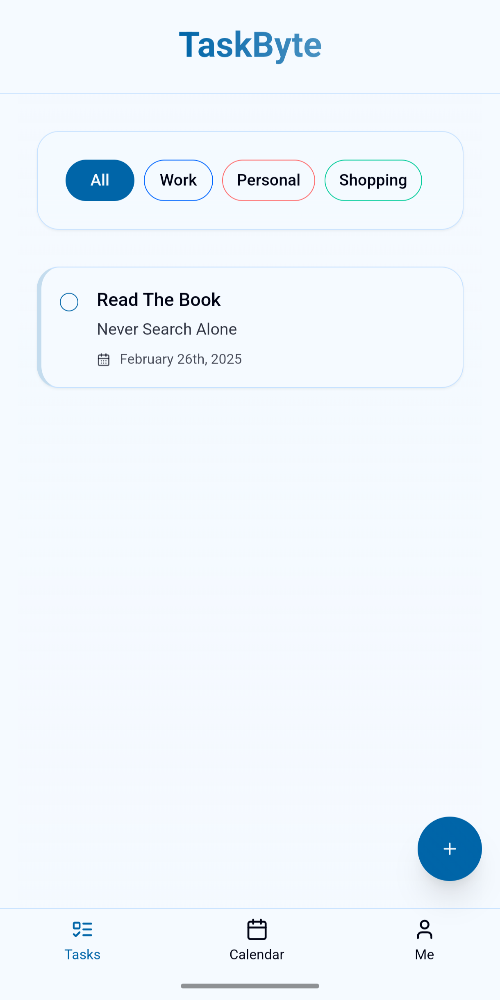

# TaskByte - Modern Task Management App

A modern task management application with advanced user experience, featuring dynamic task organization and intuitive interface design.



## Features

- ✨ Modern, responsive interface
- 📱 Bottom navigation with floating action button
- 📅 Calendar view for task scheduling
- 🏷️ Category-based task organization
- 📊 Task progress tracking
- 🎯 Task suggestions
- ⚡ Real-time updates

## Tech Stack

- **Frontend:**
  - React with Vite
  - Zustand for state management
  - TanStack Query for data fetching
  - Tailwind CSS + shadcn/ui for styling
  - date-fns for date manipulation
  - Lucide React for icons

- **Backend:**
  - Express.js
  - PostgreSQL with Drizzle ORM
  - Zod for validation

## Quick Start

1. Clone the repository:
```bash
git clone https://github.com/yourusername/taskbyte.git
cd taskbyte
```

2. Install dependencies:
```bash
npm install
```

3. Set up environment variables:
Create a `.env` file with:
```
DATABASE_URL=your_postgresql_database_url
```

4. Start the development server:
```bash
npm run dev
```

The application will be available at `http://localhost:5000`.

## Project Structure

```
├── client/
│   ├── src/
│   │   ├── components/
│   │   │   ├── ui/           # shadcn/ui components
│   │   │   ├── task-card.tsx
│   │   │   ├── task-calendar.tsx
│   │   │   ├── task-filters.tsx
│   │   │   ├── task-form.tsx
│   │   │   ├── task-list.tsx
│   │   │   ├── task-progress.tsx
│   │   │   └── task-suggestions.tsx
│   │   ├── pages/
│   │   │   ├── home.tsx      # Task list view
│   │   │   ├── calendar-view.tsx
│   │   │   └── me-view.tsx   # User profile & progress
│   │   └── App.tsx
├── server/
│   ├── routes.ts
│   ├── storage.ts
│   └── index.ts
└── shared/
    └── schema.ts
```

## Core Features

### Task Management
- Create, update, and delete tasks
- Mark tasks as complete/incomplete
- Set due dates and categories
- Filter tasks by category

### Calendar View
- View tasks in a calendar layout
- Navigate between months
- Quick view of upcoming tasks

### Progress Tracking
- View overall task completion progress
- Track tasks by category
- Visual progress indicators

### Category Management
- Create custom categories
- Assign colors to categories
- Delete categories (tasks will be moved to "general")

## API Endpoints

### Tasks
- `GET /api/tasks` - Get all tasks
- `POST /api/tasks` - Create a new task
- `PATCH /api/tasks/:id` - Update a task
- `DELETE /api/tasks/:id` - Delete a task

### Categories
- `GET /api/categories` - Get all categories
- `POST /api/categories` - Create a new category
- `DELETE /api/categories/:id` - Delete a category

## Contributing

1. Fork the repository
2. Create your feature branch: `git checkout -b feature/AmazingFeature`
3. Commit your changes: `git commit -m 'Add some AmazingFeature'`
4. Push to the branch: `git push origin feature/AmazingFeature`
5. Open a Pull Request

## License

This project is licensed under the MIT License - see the LICENSE file for details.
